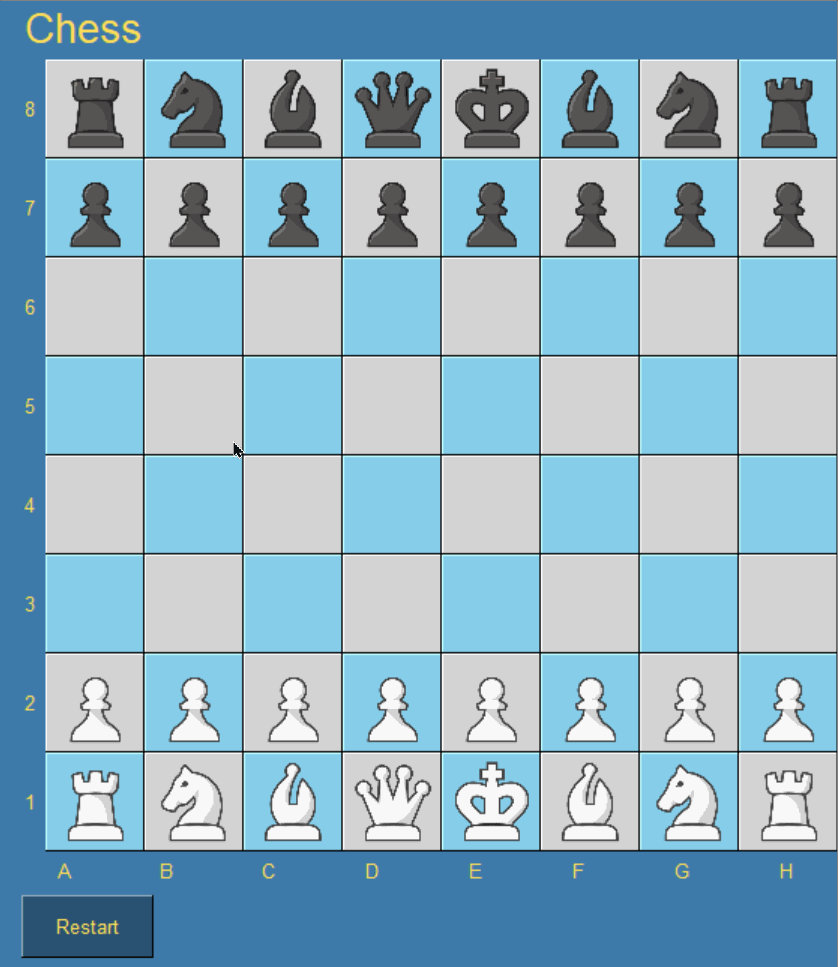
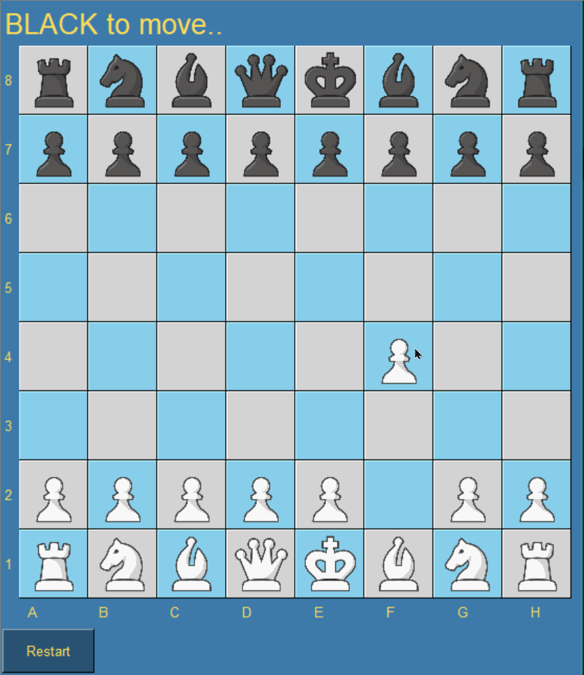

# ♟ Simple Chess GUI

A simple, user-friendly chess graphical user interface (GUI) built using [PySimpleGUI](https://www.pysimplegui.org/en/latest/).

&nbsp;&nbsp;

## 🎨 Features

- Play against a friend
- User-friendly, intuitive interface
- Legal moves highlighter
- All chess moves are available:
	- Castling | Pawn Promotion | En passant
<!-- - Choose from three difficulty levels for computer opponent -->
<!-- - Automatic save and load functionality -->

## ⚙ Tools

- [Python Chess](https://python-chess.readthedocs.io/en/latest/): Move generations and validations are made using this powerful chess library
- [PySimpleGUI](https://www.pysimplegui.org/en/latest/): Beautiful GUI is created within a few lines of code by the help of this amazing library 

## 🐍 Requirements

- Python 3.9 or higher

<!-- ## Installation

- Download the latest version of the Chess GUI from the releases page.
- Unzip the downloaded file.
- Navigate to the unzipped directory and double-click on chess-gui.jar to launch the application. -->

## 💡 Gameplay

- To start a new game, click on the **New Game** button.
- To make a move, click on the piece you want to move 
- Board will automatically highlight all the legal moves for the selected piece
- Click on the highlighted square and the move will be made
- The king will be highlighted in red if in check.
- Game will end in one of the following conditions: 
	1. Checkmate
	2. Stalemate
	3. Insufficient materials
<!-- - Select whether you want to play against a friend or against the computer.
- If playing against the computer, select the desired difficulty level.
- The game board will appear and gameplay will begin. -->
<!-- - To save the current game, click on the Save button in the top toolbar. The game will be saved and can be loaded at a later time by clicking on the Load button. -->

## 🤩 Starcatcher

If you like this project, you can support me by giving a ⭐.

## 👨‍🚀 Contact

- GitHub: [@IndieCoderMM](https://github.com/indiecodermm/)
- Email: hthant00chk@gmail.com
- LinkedIn: [@hthantoo](https://linkedin.com/in/hthantoo/)

## 🏗 Contributions

Contributions are welcome! If you have any ideas for new features or improvements, please open an issue or submit a pull request.

## 📜 License

This project is licensed under the [MIT](MIT.md) License.
